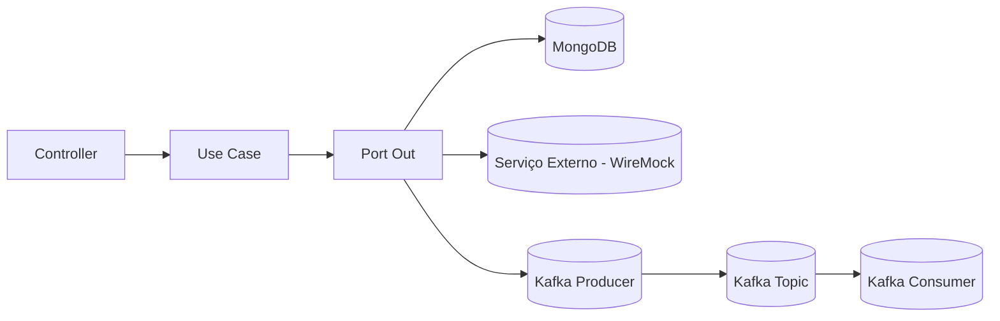

# 🧱 HexArch  
> Arquitetura Hexagonal + Spring Boot + Kafka + Docker + WireMock + MongoDB

Este projeto demonstra a aplicação prática da Arquitetura Hexagonal (Ports & Adapters) em uma API de gerenciamento de clientes. O foco está na separação de responsabilidades, testabilidade, escalabilidade e independência de frameworks.

## 📚 Sobre o Projeto

A aplicação simula um fluxo completo de cadastro e atualização de clientes, incluindo:

- 📬 Busca de endereço por CEP (via serviço externo simulado com WireMock)  
- 🧾 Validação de CPF (via Kafka)  
- 📡 Comunicação assíncrona entre serviços  
- 🧱 Persistência em MongoDB  

## 🏗️ Estrutura do Projeto

```
src/main/java/com/carvalho/hexagonal_architecture
├── adapters/
│   ├── in/
│   │   ├── controller/
│   │   │   ├── CustomerController.java
│   │   │   ├── request/
│   │   │   │   └── CustomerRequest.java
│   │   │   ├── response/
│   │   │   │   ├── CustomerResponse.java
│   │   │   │   └── AddressResponse.java
│   │   │   └── mapper/
│   │   │       └── CustomerMapper.java
│   │   └── consumer/
│   │       ├── CustomerMessage.java
│   │       └── mapper/
│   │           └── ReceiveValidatedCpfConsumerMapper.java
│   └── out/
│       ├── client/
│       │   ├── FindAddressByZipCodeClient.java
│       │   ├── response/
│       │   │   ├── AddressResponse.java
│       │   │   └── FindAddressByZipCodeClient.java
│       │   └── mapper/
│       │       └── AddressResponseMapper.java
│       └── repository/
│           ├── CustomerRepository.java
│           ├── DeleteCustomerByIdAdapter.java
│           ├── FindAddressByZipCodeAdapter.java
│           ├── FindCustomerByIdAdapter.java
│           ├── InsertCustomerAdapter.java
│           ├── SendCpfValidationAdapter.java
│           ├── UpdateCustomerAdapter.java
│           ├── entity/
│           │   ├── AddressEntity.java
│           │   └── CustomerEntity.java
│           └── mapper/
│               └── CustomerEntityMapper.java
├── application/
│   ├── core/
│   │   ├── domain/
│   │   │   └── Customer.java
│   │   └── usecase/
│   │       ├── DeleteCustomerByIdUseCase.java
│   │       ├── FindCustomerByIdUseCase.java
│   │       ├── InsertCustomerUseCase.java
│   │       └── UpdateCustomerUseCase.java
│   └── ports/
│       ├── in/
│       │   ├── DeleteCustomerByIdInputPort.java
│       │   ├── FindCustomerByIdInputPort.java
│       │   ├── InsertCustomerInputPort.java
│       │   └── UpdateCustomerInputPort.java
│       └── out/
│           ├── DeleteCustomerByIdOutputPort.java
│           ├── FindAddressByZipCodeOutputPort.java
│           ├── FindCustomerByIdOutputPort.java
│           ├── InsertCustomerOutputPort.java
│           ├── SendCpfValidationOutputPort.java
│           └── UpdateCustomerOutputPort.java
├── config/
│   ├── DeleteCustomerByIdConfig.java
│   ├── FindCustomerByIdConfig.java
│   ├── InsertCustomerConfig.java
│   ├── KafkaConsumerConfig.java
│   ├── KafkaProducerConfig.java
│   └── UpdateCustomerConfig.java
└── HexagonalApplication.java
```

## 🚀 Tecnologias Utilizadas

| Categoria           | Tecnologias         |
|---------------------|---------------------|
| **Linguagem**        | Java 17             |
| **Framework**        | Spring Boot         |
| **Build Tool**       | Gradle              |
| **Mensageria**       | Apache Kafka        |
| **Container**        | Docker & Docker Compose |
| **Banco de Dados**   | MongoDB             |
| **Testes/Stub**      | WireMock            |
| **Arquitetura**      | ArchUnit            |
| **Utilitários**      | Lombok              |

## ⚙️ Como Executar

### 1️⃣ Clonar o repositório

```bash
git clone https://github.com/Braulio-Carvalho/hexagonal-architecture.git
cd hexagonal-architecture
```

### 2️⃣ Subir dependências com Docker

```bash
docker-compose -f docker-local/docker-compose.yml up -d
```

### 3️⃣ Rodar a aplicação

```bash
./gradlew bootRun
```

A aplicação estará disponível em: http://localhost:8081

## 🧪 Executando Testes

```bash
./gradlew test
```

Inclui testes de arquitetura com ArchUnit para validar regras de camadas e convenções de nomes.

## 📡 Endpoints Principais

| Método   | Endpoint                  | Descrição                  |
|----------|---------------------------|----------------------------|
| POST     | `/customers`              | Cadastrar cliente          |
| GET      | `/customers/{id}`         | Buscar cliente por ID      |
| PUT      | `/customers/{id}`         | Atualizar cliente          |
| DELETE   | `/customers/{id}`         | Remover cliente            |
| GET      | `/address/{zipcode}`      | Buscar endereço por CEP    |

## 🧪 Stubs do WireMock para CEP

Crie a pasta: `wiremock/mappings/`  
Adicione os arquivos de mapeamento como `address.json`, `address2.json`, etc.

Exemplo de teste rápido:

```bash
curl http://localhost:8082/addresses/38400000
```

## 🧭 Fluxo da Arquitetura



## 📄 Licença

Este projeto está sob a licença MIT – veja o arquivo LICENSE para mais detalhes.
